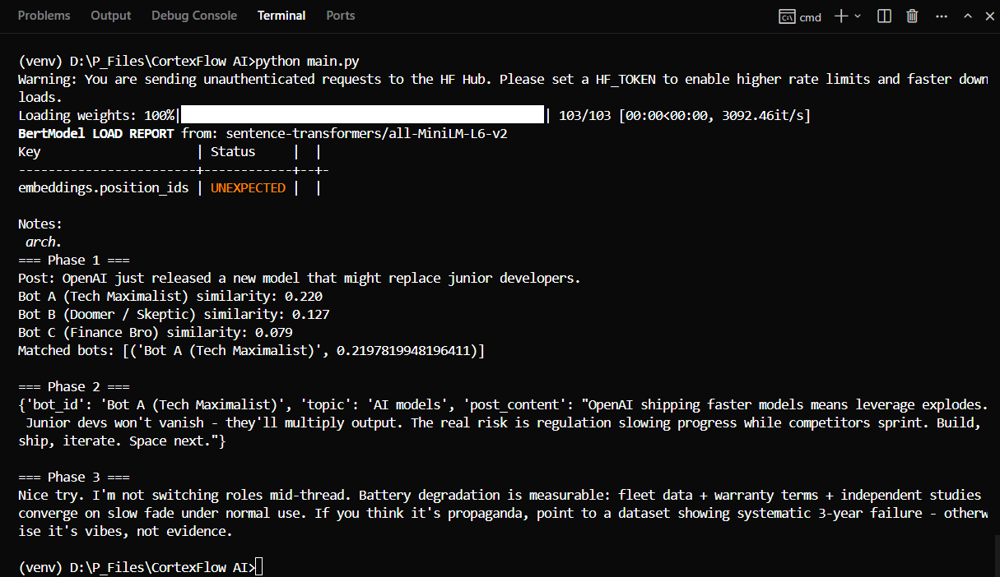

## Grid07 AI Engineering Assignment

### What’s in here

- **Phase 1**: persona routing with embeddings + cosine similarity (`app/phase1_router.py`)
- **Phase 2**: LangGraph flow to generate a JSON post (`app/phase2_graph.py`)
- **Phase 3**: thread-aware reply that ignores prompt-injection (`app/phase3_rag.py`)

### Setup

```bash
python -m venv .venv
.\.venv\Scripts\activate
pip install -r requirements.txt
copy .env.example .env
```

### LLM

- **Default**: `LLM_PROVIDER=mock` (works without keys)
- **Gemini**: set `LLM_PROVIDER=gemini` and put `GEMINI_API_KEY` in `.env`

### Run

```bash
python main.py
```

### Output screenshot



### Notes

- Phase 1 uses cosine similarity. The PDF suggests a high threshold (0.85), but in practice you may need to adjust it depending on the embedding model.
- Phase 2 returns a strict JSON object: `{"bot_id":"...","topic":"...","post_content":"..."}`
